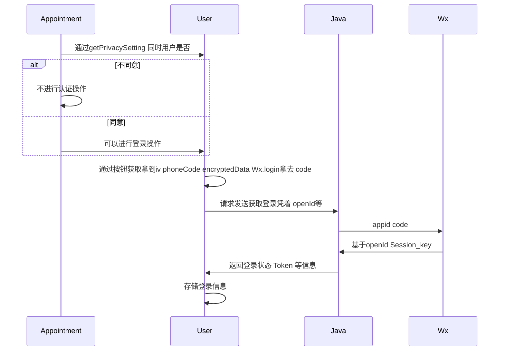

## 微信小程序

### 登录流程

```mermaid
sequenceDiagram
  participant Appointment
    participant User
    participant Java
  participant Wx
    Appointment->> User: 通过getPrivacySetting 同时用户是否
   alt 不同意
    Appointment ->> Appointment: 不进行认证操作
   else 同意
    Appointment ->> User: 可以进行登录操作
   end
  User ->> User: 通过按钮获取拿到iv phoneCode  encryptedData Wx.login拿去 code 
  User ->> Java: 请求发送获取登录凭着 openId等
  Java ->> Wx: appid code 
  Wx ->> Java: 基于openId  Session_key
  Java ->> User: 返回登录状态 Token 等信息
  User ->> User: 存储登录信息
   
```
